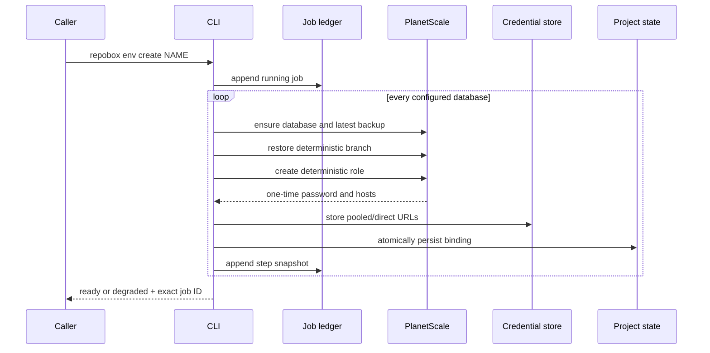
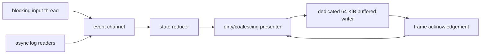

# Repobox architecture

Repobox v0.1 is a local control plane. Application processes stay on the developer's machine; durable PostgreSQL data lives in PlanetScale. There is no daemon and no hosted Repobox service.

## Workspace

| Crate | Responsibility |
|---|---|
| `repobox` | CLI grammar, orchestration, credential resolution, managed agent guides, TUI, and user output. |
| `repobox-core` | Strict config, deterministic identity, provider/runtime traits, structured envelopes/errors, atomic state, durable jobs, paths, and redaction. |
| `repobox-provider-planetscale` | Direct PlanetScale HTTPS adapter with service-token auth, retries, pagination, and typed database/backup/branch/role operations. |
| `repobox-runtime-compose` | Canonical Compose detection, PostgreSQL classification, transient project transformation, runtime control, status, and logs. |

Dependency direction is inward: adapters depend on `repobox-core`; core has no dependency on a concrete provider, runtime, TUI, or CLI.

## Environment identity

The local environment name resolves from `--environment`, `REPOBOX_ENV`, then the current Git branch. Provider branch names derive from:

```text
project UUID + normalized environment slug + collision-resistant hash
```

This identity is stable across repository moves and clones that retain `.repobox.yml`. It is bounded for provider naming rules and avoids collisions between slugs such as `feature/a` and `feature-a`.

## Create flow



Successful services are retained when another database fails. The environment becomes `degraded`, and rerunning create or `job resume UUID` skips already-complete provider work where possible.

## Pull flow

Each database refresh checkpoints these forward-only phases:

```text
planned -> staged -> credentialed -> old_deleted -> swapped -> complete
```

A staging branch is restored and validated before the canonical environment branch is deleted. Once `old_deleted` is reached, recovery proceeds forward; Repobox does not claim that the old data can be restored. Compose services are stopped before the operation and restarted only after every configured target completes.

## Compose boundary

Repobox asks Docker Compose to resolve the repository's files, profiles, interpolation, and merge behavior first. It then modifies the resolved model in memory:

1. remove configured remote PostgreSQL services;
2. remove dependencies on those services;
3. inject configured pooled/direct URLs into remaining services;
4. serialize the transient model and pass it as `docker compose -f -` stdin.

Source Compose and env files stay untouched. Credentials do not appear in a temporary file or command-line argument.

## Secret boundary

Provider credentials resolve in this order:

1. `PLANETSCALE_SERVICE_TOKEN_ID` and `PLANETSCALE_SERVICE_TOKEN` together;
2. persistent OS credential service;
3. an explicit permission-restricted file fallback under the user config directory.

Database URLs use the same credential layer under project/environment/service-specific keys. Config, state, jobs, agent guides, dry-run plans, and normal logs contain identifiers but not passwords.

## TUI kernel

The terminal kernel follows a Grok-inspired event pipeline:



The presenter allows at most one frame in flight and caps repaint frequency at roughly 60 Hz. Input remains prioritized, log events are batched, and the reducer bounds retained lines. Raw mode, alternate screen, synchronized updates, cursor visibility, and terminal restoration are owned by RAII guards.

## Hosted compute seam

`RuntimeDriver` is the extension point for later E2B, Modal, or similar execution. A hosted adapter will need code synchronization, process lifecycle, logs, status, secret injection, and terminal passthrough, but should not change environment identity, provider jobs, configuration discovery, or JSON contracts.

## Durable files

Platform directories are discovered with XDG-compatible APIs:

```text
config/repobox/config.yml              user preferences
config/repobox/credentials.json        explicit file fallback only
state/repobox/projects/<uuid>/state.json
state/repobox/projects/<uuid>/jobs.jsonl
cache/repobox/update-check.json
```

State writes use a same-directory temporary file, sync, and rename. Jobs are append-only snapshots; readers select the highest/latest snapshot for each UUID.
