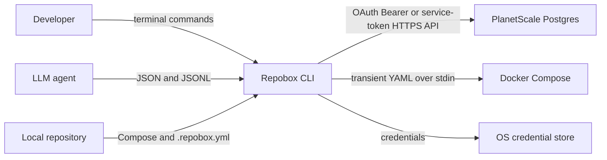
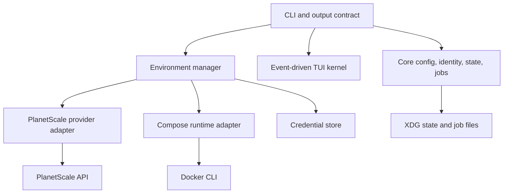

# Feature Spec: Branch-scoped development data

> Repobox gives every local Git branch persistent remote PostgreSQL data while application processes remain local. The first implementation uses PlanetScale and Docker Compose through a terminal-only Rust CLI that is equally operable by humans and agents.

## Summary

`repobox run` detects or loads a strict repository configuration, provisions isolated remote PostgreSQL data for the selected Git environment, injects credentials into local processes, and presents local service logs in a fast terminal interface. Provider mutations are checkpointed to an append-only job ledger and every scriptable operation has a versioned JSON or JSONL representation.

## Decision required

Confirm that v0.1 should ship the local control-plane architecture, PlanetScale-only PostgreSQL provider, OAuth device login with service-token automation, forward-only pull semantics, and versioned agent CLI contract described here before the first tagged release.

## Problem and user need

Local application processes are cheap to restart, but databases are expensive in disk, memory, setup time, and state management. Developers and coding agents frequently share one local database across branches, lose useful fixtures when containers are removed, or spend time rebuilding data that should have persisted. A repository also lacks a standard way to tell an agent how to acquire the correct development data without leaking credentials into project files.

Repobox needs to make durable data feel like part of the repository while remaining codebase-agnostic. A developer should switch Git branches and receive a stable corresponding data environment. An agent should discover, preview, approve, execute, inspect, and recover the same operation without parsing terminal decoration or waiting on an invisible prompt.

## Current behavior

Without Repobox, each repository invents its own Compose lifecycle, environment-file convention, database copy script, and agent instructions. Compose PostgreSQL containers consume local storage and memory. Branches usually share one mutable database. Credentials are often copied into `.env` files. There is no durable provider-operation ledger, deterministic remote branch identity, or common structured-output contract.

## Proposed behavior

1. `repobox init` detects every PostgreSQL service in resolved Docker Compose configuration, writes `.repobox.yml`, and updates managed blocks in `CLAUDE.md` and `AGENTS.md` without replacing surrounding content.
2. An environment resolves from `--environment`, then `REPOBOX_ENV`, then the current Git branch. `main` is treated exactly like any other environment.
3. Each configured database service maps to one PlanetScale PostgreSQL database. Repobox restores a branch from the latest successful base-branch backup and selects the smallest eligible numeric cluster SKU unless configuration pins one.
4. `repobox auth login` uses PlanetScale OAuth device authorization by default: it opens the approval URL, polls for a Bearer access token, validates it, and stores it outside the repository. JSON mode emits the URL/code as `auth_pending`; unattended automation retains environment-first service-token authentication.
5. Repobox creates a deterministic role inheriting `postgres`, stores its returned one-time credentials in an OS credential store with an explicit permission-restricted file fallback, and injects pooled/direct URLs only into child-process environments.
6. The Compose adapter resolves canonical Compose first, removes remote PostgreSQL services and their dependencies in memory, injects connection variables into remaining services, and passes the transformed YAML over stdin. It never edits the repository's Compose files.
7. `repobox pull` stages fresh branches, provisions credentials and extensions, deletes old environment branches, then renames staging branches forward. If any service fails, local services remain stopped and the durable job can be resumed.
8. Human terminals receive concise text or a full-screen dashboard. `--json` returns versioned JSON; streams return JSONL; non-interactive mutations require `--yes`; `--dry-run` performs no provider call or repository write.

## Affected capabilities

- `branch-scoped-development-data` — creates persistent, isolated remote Postgres data for every Git environment.
- `agent-native-dev-environments` — makes the complete control surface discoverable and parseable by LLM callers.
- `local-runtime-orchestration` — runs application services locally with remote stateful dependencies removed from Compose.
- `durable-provider-operations` — checkpoints multi-step create, delete, and refresh jobs for recovery.

## Affected systems and components

| System | Component | Impact |
|---|---|---|
| `repobox-cli` | Clap command grammar | Adds init, run, stop, pull, auth, env, service, job, config, telemetry, update, doctor, completion, and agent-context surfaces. |
| `repobox-cli` | Ratatui kernel | Adds event-driven setup and dashboard TUIs with coalesced rendering and one frame in flight. |
| `repobox-core` | Config, identity, state, jobs | Defines strict config, deterministic names, atomic state, structured errors, schemas, and append-only jobs. |
| `planetscale-api` | PostgreSQL provider | Implements OAuth device authorization, Bearer and service-token API auth, revocation, pagination, database/backup/branch/role operations, retries, and request-ID propagation. |
| `docker-compose` | Runtime adapter | Detects PostgreSQL services and applies an in-memory Compose transform. |
| Developer repository | `.repobox.yml`, agent guides | Stores non-secret project intent and idempotent managed instruction blocks. |

## API and data model changes

The repository contract is a strict, versioned YAML document. Unknown keys fail validation.

```yaml
version: 1
project:
  id: 018f6f4e-7040-7000-8000-000000000001
  name: example
  git:
    base_branch: main
runtime:
  driver: compose
  compose:
    files: [compose.yaml]
services:
  db:
    kind: postgres
    primary: true
    local:
      compose_service: db
    remote:
      provider: planetscale
      organization: acme
      database: example
      base_branch: main
      cluster_size: auto-smallest
    bootstrap:
      mode: empty
    env:
      pooled: DATABASE_URL
      direct: DIRECT_DATABASE_URL
data:
  allow_copy: false
agents:
  claude: true
  codex: true
```

Immediate machine output uses a stable envelope. Long provider mutations use JSONL through a final `result` event. Mutations add either an executable inverse or an explicit reason no inverse exists.

```json
{
  "schema_version": 1,
  "sequence": 4,
  "timestamp": "2026-07-22T00:00:00Z",
  "event": "result",
  "data": {
    "environment": {},
    "job": {},
    "resumed": false,
    "undo_command": "repobox env delete feature/demo --yes",
    "undo_reason": null
  }
}
```

Errors are written to stderr and use stable failure classes with exits 1 through 6. Stream events include `schema_version`, monotonically increasing `sequence`, timestamp, event name, and data. Durable user state lives under platform XDG directories, keyed by project UUID; provider secrets never enter the repository state model.

## Architecture diagrams

Context view:



Container view:



Repobox is deliberately a local control plane in v0.1. The provider and runtime traits form the seam for later E2B, Modal, or similar hosted execution without changing the terminal contract.

## Alternatives considered

1. **Go instead of Rust** — Go would reduce compile time, but Rust provides a strong fit for one distributable binary, explicit state machines, low-overhead terminal rendering, and safe secret-bearing process construction.
2. **Keep every dependency in local Compose** — simpler, but does not reduce local database storage/memory or deliver durable cross-session data.
3. **Run an always-on local daemon** — could coordinate background work, but adds installation, lifecycle, IPC, and security complexity before the workflow requires it.
4. **Edit Compose or `.env` files on disk** — familiar, but creates secret leakage and merge-noise risks. Passing transformed YAML over stdin preserves repository ownership.
5. **Use Terraform as the user interface** — strong for declarative infrastructure, but slow for the branch-by-branch development loop and poor as a direct LLM-operable log/runtime surface.
6. **Delete then recreate during pull without staging** — fewer resources, but increases downtime and makes provider failures more likely to leave no usable target. The selected swap temporarily overlaps one billable branch.

## Risks and mitigations

| Risk | Severity | Likelihood | Mitigation |
|---|---|---|---|
| PlanetScale branches create unexpected cost | High | Medium | Require confirmation, emit dry-run provider calls and cost warning, choose the smallest eligible SKU, and make pruning explicit. |
| `pull` destroys useful environment-local data | High | Medium | Name the destructive effect in help and confirmation, stage before deletion, checkpoint each phase, and never imply rollback exists. |
| A multi-database operation partially succeeds | Medium | Medium | Preserve successful bindings, mark the environment degraded, keep services stopped during failed pulls, and expose exact resumable job IDs. |
| Credentials leak through files, argv, or logs | High | Low | Use device approval or environment-only service secrets, keep tokens in keyring or a mode-0600 fallback, inject process env in memory, redact URLs, and test repository outputs. |
| The shared public PlanetScale CLI OAuth client changes or is restricted | Medium | Low | Pin the reviewed upstream protocol/client provenance, wire-test the flow, retain service-token fallback, and gate release on live browser login. |
| Compose transformation changes application semantics | Medium | Medium | Resolve Compose canonically, change only database services/dependencies/env, keep source files untouched, and cover transforms with fixtures. |
| Terminal rendering flickers or corrupts the shell | Medium | Low | Use dirty/coalesced presentation, Ratatui diff rendering, synchronized updates, dedicated buffered I/O, and RAII terminal restoration. |
| Provider API behavior drifts | Medium | Medium | Keep the API behind a trait, classify structured failures, test auth/pagination, and gate release on a live smoke run. |

## Rollout and migration plan

1. Land the Rust workspace, public schemas, documentation, and CI on `main` without publishing a version.
2. Run all offline tests on Linux and macOS and build the four release targets.
3. Execute browser login plus service-token automation against a dedicated PlanetScale organization, complete the live-smoke checklist, verify billable resources and cleanup, and record the tested provider behavior.
4. Tag `v0.1.0`; publish checksummed GitHub artifacts, crates, provenance attestations, and a Homebrew formula.
5. Treat schema or flag removal as a major-version change; additive fields and commands remain backward compatible.

### Rollback plan

Before a tagged release, revert the implementation commit or remove the unpublished repository. After release, stop new installs by marking the release as a prerelease/deprecated and publish a patch. Existing remote environments are not deleted automatically: users inspect them with `repobox env list` and explicitly run `repobox env delete NAME --yes`. A partially completed `pull` is resumed forward from its job record; there is intentionally no data rollback after the old branch is deleted.

## Test plan

- Unit-test strict config parsing, RFC 7396 validation, name stability/collision resistance, atomic state, job replay, secret redaction, setup guide idempotence, Compose detection/transformation/status parsing, and TUI frame coalescing.
- Wire-test PlanetScale device authorization, token polling, Bearer and service-token headers, revocation, pagination, and structured permission failures against a local HTTP fixture.
- Black-box-test help, JSON usage errors, multi-Postgres detection/init, dry-run no-write behavior, schema snapshots, and secret absence in generated repository files.
- Run `cargo fmt --check`, Clippy with warnings denied, all workspace tests, and package checks in CI.
- Gate `v0.1.0` on a credentialed live smoke covering auth, create, rerun idempotence, run, pull, interruption/resume, partial failure, delete, and provider cleanup.

## Observability and operations

- The local state file records environments, provider bindings, failure details, and update timestamps.
- `jobs.jsonl` is append-only and records sequences, step status, resources, errors, and terminal state.
- Human progress and update notices go to stderr; JSON data goes to stdout; provider request IDs are attached to structured errors when available.
- `repobox status --json`, `service status`, `job view latest`, and `doctor --online` provide the v0.1 operational surface.
- Telemetry is off in behavior: v0.1 stores a preference but sends no events.

## Security and privacy review

Interactive authentication uses PlanetScale's OAuth device flow, never exposes the private device code, stores only the resulting access token, sends it as a Bearer credential, and revokes it before local logout. The device approval URL and human confirmation code are intentionally public handoff values and may appear in JSONL; access tokens may not. A browser token is also revoked after dry-run validation or a credential-storage failure so an untracked token is not intentionally left active. Service tokens remain the unattended path: the secret is never accepted as a CLI flag, serialized to project configuration, added to agent guides, or included in dry-run output. Existing stored service-token records decode without migration work. Provider database passwords are one-time responses stored through the OS credential facility, with an explicit local JSON fallback created under the user's configuration directory and permission-restricted to the user.

Data copy is opt-in through `data.allow_copy: true`. Import streams `pg_dump` directly into `psql`, creates no dump file, and stops a local Compose database only if Repobox started it. Repobox does not mask or anonymize imported data in v0.1, so users remain responsible for the classification of source data. Remote branches and backups may be billable and must be created only in an authorized organization.

## Open questions

Before the first tag, decide whether PlanetScale should issue Repobox a dedicated public OAuth client. The implementation currently follows the official CLI's intentionally non-confidential device client and keeps service-token auth as a fallback. Hosted compute, masking hooks, additional database providers, and periodic source resync remain later-version work.

## Reviewer prompts

### Architecture reviewer

- Does the provider/runtime trait boundary preserve a credible path to hosted E2B or Modal execution without introducing a daemon now?
- Are the pull checkpoints sufficient to resume every forward-only failure phase without guessing provider state?

### API reviewer

- Are the versioned success, mutation, error, stream, dry-run, config, and agent-context contracts additive and unambiguous for an LLM caller?
- Does every command expose enough information to choose a safe next command without parsing human text?

### Security reviewer

- Can any OAuth access token, service token, role password, or connection URL reach argv, repository files, diagnostics, job records, or generated agent instructions?
- Is using PlanetScale CLI's public non-confidential OAuth client acceptable for v0.1, or must Repobox receive a dedicated client before tagging?
- Is the permission-restricted credential fallback explicit enough for systems without a usable native keyring?

### Operations reviewer

- Does the live-smoke gate cover provider drift, cost cleanup, interruption, and multi-service partial failure before release?
- Are users clearly warned that a failed forward-only pull intentionally leaves services stopped?

## Related ADRs, runbooks, tickets, PRs

- Architecture: [Repobox architecture](../architecture.md)
- Agent API: [Agent and automation contract](../agent-contract.md)
- Configuration: [Configuration reference](../configuration.md)
- Operations: [Live provider smoke](../live-smoke.md)
- ADRs: None — the accepted v0.1 decisions are consolidated in this specification for the initial repository.
- Tickets and PRs: None — this is the repository bootstrap implementation.

## Appendix

The TUI kernel is inspired by Grok Build's rendering discipline rather than its product surface: reducers own state, a presenter marks frames dirty and coalesces invalidations, only one frame may be in flight, output is written on a dedicated buffered thread, input has a dedicated blocking thread, and the paint rate is capped near 60 Hz without an always-running timer. Repobox uses upstream Ratatui and synchronized terminal updates instead of copying Grok Build's inline-terminal fork.

The initial release does not run application code remotely. Its role is to prove persistent data, deterministic environment identity, safe Compose bridging, and the human/agent terminal contract. Later compute providers should implement the runtime trait and keep the same commands and output envelopes.
